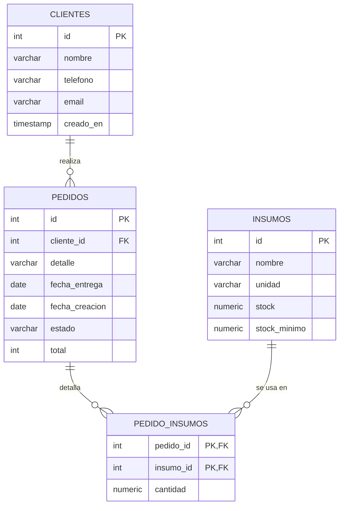

# Modelo entidad-relación (MER)

Diagrama del modelo relacional de la **aplicación web Pastelería Martina**. Es la
representación formal de la base de datos definida en
[`/db/schema.sql`](../db/schema.sql), con sus datos de prueba en
[`/db/seed.sql`](../db/seed.sql).

> El diagrama usa Mermaid: GitHub y la mayoría de los visores de Markdown lo
> renderizan automáticamente.

## Entidades

| Entidad | Descripción |
|---------|-------------|
| **CLIENTES** | Personas que encargan pedidos. |
| **PEDIDOS** | Cada encargo de un cliente, con su estado y monto. |
| **INSUMOS** | Materias primas del taller y su nivel de stock. |
| **PEDIDO_INSUMOS** | Tabla intermedia: qué insumos (y en qué cantidad) consume cada pedido. |

## Relaciones y cardinalidad

- **CLIENTES (1) — (N) PEDIDOS:** un cliente puede tener muchos pedidos; cada
  pedido pertenece a un único cliente (`pedidos.cliente_id → clientes.id`).
- **PEDIDOS (N) — (M) INSUMOS:** un pedido usa varios insumos y un insumo aparece
  en varios pedidos. Esta relación muchos-a-muchos se resuelve con la tabla
  intermedia **PEDIDO_INSUMOS**, cuya llave primaria compuesta
  (`pedido_id`, `insumo_id`) también actúa como llave foránea hacia cada lado.

## Notas de diseño

- El campo `pedidos.estado` está restringido por un `CHECK` a los valores del
  flujo de trabajo: **cotizado → confirmado → en producción → entregado**, lo que
  garantiza la integridad de la trazabilidad del pedido.
- `pedidos.total` se expresa en pesos chilenos (entero); el valor `0` representa
  un pedido "por cotizar".
- `insumos.stock_minimo` permite calcular las alertas de inventario crítico
  (cuando `stock <= stock_minimo`).
- El modelo está normalizado: los datos del cliente no se repiten en cada pedido,
  sino que se referencian por `cliente_id`.

## Equivalencia con el modelo en memoria

El backend en memoria refleja este modelo de forma **simplificada**: cada pedido
incluye un arreglo `insumosEstimados` con objetos `{ insumoId, cantidad }`. Eso
representa, de manera embebida, la misma relación **N:M pedido–insumo** que en SQL
está normalizada en la tabla intermedia **PEDIDO_INSUMOS**. Con esos datos, el
panel calcula el **stock comprometido** (consumo de los pedidos en curso) y el
**stock proyectado** de cada insumo, lo que alimenta las recomendaciones de
reposición. La forma embebida es práctica para una base de datos en memoria; la
forma normalizada (tabla intermedia) es la correcta para una base de datos
relacional.
